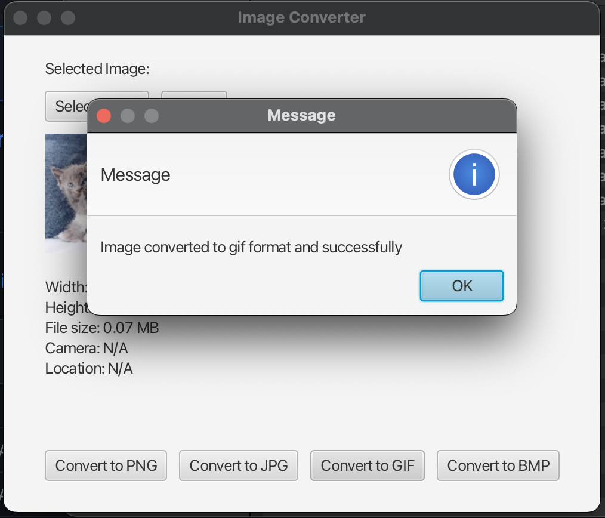

# Image Management Tool

## Basic functions

### Default View

### Select Image

### Show Thumbnail and metadata of selected img

### Convert to a specific format and select save directory

### Successfully converted

### Converted img

### Error Message

## Diagram
Please refer to Diagram.pdf.